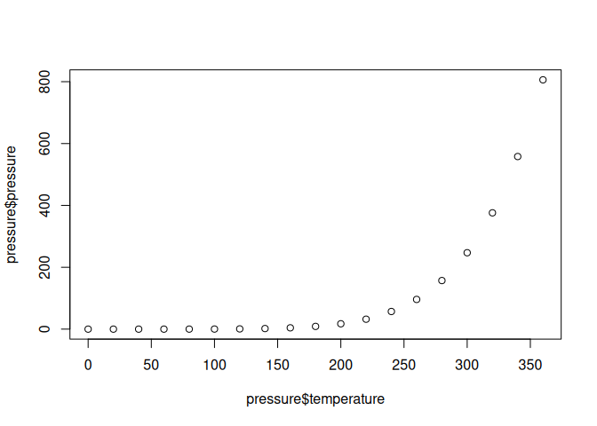
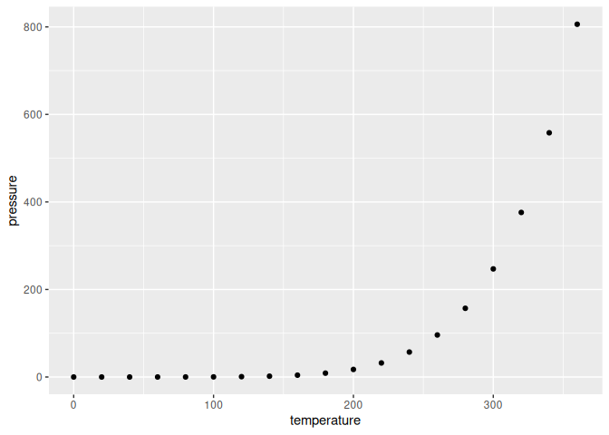

<!-- README.md is generated from README.Rmd. Please edit that file -->

# numerals

<!-- badges: start -->

[](https://www.repostatus.org/#concept)
[](https://CRAN.R-project.org/package=numerals)
[](https://github.com/joeroe/numerals/actions)
<!-- badges: end -->

**numerals** is an R package that extends the base numeric types with
methods for printing using UTF digits from international numeral
systems. It currently supports Eastern Arabic (`"ar"`) and Persian
(`"fa"`) numerals.

## Installation

You can install the development version of numerals from GitHub using
[devtools](https://devtools.r-lib.org/):

``` r
# install.package("devtools")
devtools::install_github("joeroe/numerals")
```

numerals has not yet been released on CRAN.

<!--
You can install the released version of numerals from [CRAN](https://CRAN.R-project.org) with:

``` r
install.packages("numerals")
```
-->

## Usage

`numeral()` creates a numeric vector which is printed in another numeral
system:

``` r
library("numerals")
# Eastern Arabic numerals
numeral(1:10, "ar")
#> <numeral[10]>
#>  [1]  ١  ٢  ٣  ٤  ٥  ٦  ٧  ٨  ٩ ١٠

# Persian numerals
numeral(1:10, "fa")
#> <numeral[10]>
#>  [1]  ۱  ۲  ۳  ۴  ۵  ۶  ۷  ۸  ۹ ۱۰
```

Numerals are compatible with both base and tidyverse packages. For
example, they are printed in data frames and
[tibbles](https://tibble.tidyverse.org/):

``` r
library("tibble")
x <- data.frame(en = 1:10, ar = numeral(1:10, "ar"), fa = numeral(1:10, "fa"))

x
#>    en ar fa
#> 1   1  ١  ۱
#> 2   2  ٢  ۲
#> 3   3  ٣  ۳
#> 4   4  ٤  ۴
#> 5   5  ٥  ۵
#> 6   6  ٦  ۶
#> 7   7  ٧  ۷
#> 8   8  ٨  ۸
#> 9   9  ٩  ۹
#> 10 10 ١٠ ۱۰
as_tibble(x)
#> # A tibble: 10 x 3
#>       en     ar     fa
#>    <int> <numr> <numr>
#>  1     1      ١      ۱
#>  2     2      ٢      ۲
#>  3     3      ٣      ۳
#>  4     4      ٤      ۴
#>  5     5      ٥      ۵
#>  6     6      ٦      ۶
#>  7     7      ٧      ۷
#>  8     8      ٨      ۸
#>  9     9      ٩      ۹
#> 10    10     ١٠     ۱۰
```

<!--
And can be used as scales in base and [ggplot2](https://ggplot2.tidyverse.org/):


```
#> Don't know how to automatically pick scale for object of type numeral/vctrs_vctr. Defaulting to continuous.
#> Don't know how to automatically pick scale for object of type numeral/vctrs_vctr. Defaulting to continuous.
```


-->

Otherwise, numerals are freely coercible to base numerics and so can be
used in calculations:

``` r
numeral(2, "ar") * 10
#> <numeral[1]>
#> [1] ٢٠
```
